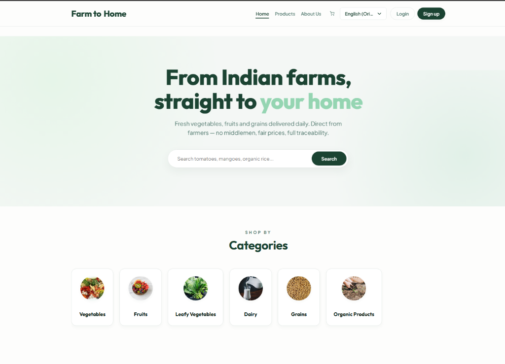

# 🚜 Farm to Home — Direct Farm-to-Consumer (F2C) E-Commerce Platform

**Farm to Home** is a modern, full-stack direct-to-consumer (F2C) e-commerce web platform designed to empower local Indian farmers by connecting them directly with household consumers. By eliminating traditional middlemen and wholesale market exploitation, the platform guarantees **100% fresh farm-harvested produce for consumers** and **fair, transparent earnings for farmers**.

---

## 🌐 Live Application & Repositories

*   **Main GitHub Repository:** [https://github.com/mscharan6303/Farm-to-home.git](https://github.com/mscharan6303/Farm-to-home.git)
*   **Backup Copy Repository:** [https://github.com/mscharan6303/Farm-to-home-copy.git](https://github.com/mscharan6303/Farm-to-home-copy.git)
*   **Live Deployed Application:** [https://farm-to-home.vercel.app](https://farm-to-home.vercel.app) *(or local environment at `http://localhost:5173`)*

---

## 🔑 Live Demo Credentials

Explore all 4 specialized roles in the system using these pre-configured demo credentials:

| User Role | Email Address | Password | Key Responsibilities & Capabilities |
| :--- | :--- | :--- | :--- |
| 🛒 **Customer (Buyer)** | `customer@demo.com` | `password123` | Browse fresh produce, watch farmer video ads, order products, subscribe to FarmPass for ₹499/mo (free shipping + 10% off), live chat with farmers. |
| 🌾 **Farmer (Seller)** | `farmer@demo.com` | `password123` | Toggle harvesting availability, manage products, upload promotional video ads (1–30 days), view net 90% earnings breakdown. |
| 🛵 **Delivery Agent** | `delivery@demo.com` | `password123` | View hub orders, accept delivery tasks (prevents duplicate delivery agents), collect COD payments, mark orders as delivered. |
| 👑 **Platform Admin** | `admin@demo.com` | `password123` | Full Master Control Center across 5 tabs (Financials, Product Catalog CRUD, Orders & Overrides, Users Directory, Video Ads Control). |

---

## 🏗️ Platform Business & Logistics Architecture

### 1. Platform Monetization Model (10% Commission + Delivery Fees)
The platform owner generates net revenue through a transparent 2-stream monetization model:
*   **10% Platform Fee**: The platform retains a 10% commission fee on gross produce sales.
*   **90% Net Farmer Payout**: Registered farmers receive 90% net earnings on all delivered products.
*   **Delivery Charges**: Standard ₹49 delivery charge for non-premium orders under ₹300 (Free for FarmPass Members).

### 2. Logistics & Local Hub Delivery Model
```
[ Farmers ] ➔ ( Morning Drop at Local Hub ) ➔ [ Delivery Agents (Accept Order) ] ➔ [ Customer Doorstep ]
```
*   **Harvesting Availability Toggle**: Farmers can pause or resume daily harvesting.
*   **Single Delivery Agent Acceptance**: Delivery agents review available orders at the local hub and accept them. Once accepted, no other delivery agent can claim the order.
*   **Cash on Delivery (COD) Payment Verification**: Delivery agents collect cash payments upon delivery, mark the order as paid, and update the status in real time.

---

## 📸 Section-by-Section Walkthrough & Visual Tour

### 1. Customer Storefront & Marketplace

**Explanation:** 
The main shopping interface for consumers featuring hero banners, produce category search (Vegetables, Fruits, Leafy Greens, Dairy, Grains), and real benefits. Customers can search for items, view prices per unit, and add items to cart.

---

### 2. 📺 Farmer Promotional Video Ads & Continuous Carousel

**Explanation:**
Farmers can upload short promotional harvest video ads for their produce, specifying active duration (1 to 30 days). 
*   **Clean Page Guarantee**: If no video ads are active, the section hides automatically to keep the homepage 100% clean.
*   **Continuous Autoplay**: Plays active video ads one after another continuously.
*   **Direct Ordering**: Each video card includes direct **"🛒 Add to Cart"** and **"⚡ Order Now"** buttons overlaying product details.

---

### 3. 🌾 Farmer Dashboard (Harvest Availability & 90% Net Earnings)

**Explanation:**
A dedicated panel for farmers featuring:
*   **Harvesting Availability Toggle**: Toggle between `🟢 Harvesting Active` and `🔴 Harvesting Paused`.
*   **Net Earnings Breakdown**: Clear display of Gross Sales, 10% Commission Deducted, and **Net 90% Take-Home Earnings**.
*   **Video Ad Creator**: Create promotional ads with video links, product mapping, and duration selection.

---

### 4. 🛵 Delivery Agent Hub & Order Acceptance

**Explanation:**
A streamlined portal for delivery agents:
*   **Order Acceptance Lock**: Displays confirmed orders with an **"Accept Delivery Task"** checkbox, locking the order so no other agent can accept it.
*   **COD Payment Verification**: Mark Cash on Delivery orders as paid upon customer handoff.
*   **Customer & Address Transparency**: Shows customer name, contact phone, and exact shipping address.

---

### 5. 👑 Master Platform Admin Control Center (5 Master Control Tabs)

**Explanation:**
Complete master governance for the platform owner (`admin@demo.com`):
1.  **📊 Financials & Payouts**: Displays GMV, 10% Platform Fee, 90% Net Farmer Payouts, and **Clickable Farmer Financial Statement Modals** detailing delivered products, total amount, farmer profit, and platform profit. Includes **Paid ✅ / Unpaid ⏳** status toggles.
2.  **🥦 Product Catalog Control**: Full master CRUD (Add Product, Edit Product, Delete Product) with live website sync.
3.  **📦 Orders Master Control**: Order deletion, status overrides, COD payment toggles, and **Assigned Delivery Agent Details**.
4.  **👥 User & Accounts Directory**: Manage Customer, Farmer, Delivery, and Admin accounts with activate/suspend options.
5.  **📹 Video Ads Control**: Admin governance over all farmer promotional video ads.

---

### 6. 🌟 FarmPass Subscriptions & Membership

**Explanation:**
Allows consumers to join **FarmPass Premium** for ₹499/month to instantly unlock **Unlimited Free Delivery** and a **Flat 10% Extra Discount** on all checkout orders, alongside recurring produce basket management.

---

### 7. 🛒 Dynamic Cart, Checkout & Real-Time Tracking

**Explanation:**
Seamless shopping cart and checkout process with address selection, UPI/COD payment options, instant order placement, real-time order status tracking, and Socket.io direct messaging with farmers.

---

## 🛠️ Technology Stack

*   **Frontend:** React.js, Vite, Context API (Auth & Cart), Custom CSS (Responsive & Mobile-First), React Icons.
*   **Backend:** Node.js, Express.js.
*   **Database:** MongoDB & Mongoose.
*   **Real-Time & Sync:** Socket.io, CloudSync Local Storage Event Listeners.
*   **Media & Video:** Cloudinary, HTML5 Video & YouTube Embeds.

---

## 💻 How to Run Locally

### 1. Backend Setup
```bash
cd backend
npm install
npm run dev
```

### 2. Frontend Setup
```bash
cd frontend
npm install
npm run dev
```
Open `http://localhost:5173` in your browser to experience the platform!

---

## 📜 License & Acknowledgments

Developed by **M. S. Charan**. Designed to support sustainable Indian agriculture, empower local farmers, and provide fresh produce to every household.
